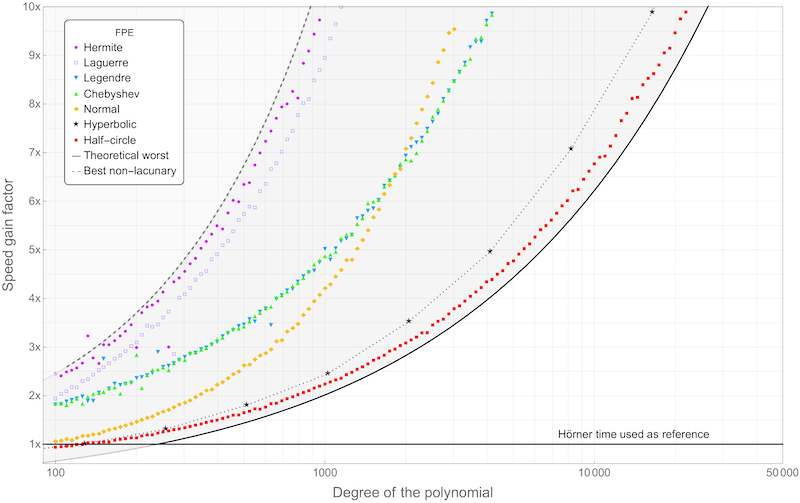

# FastPolyEval : a Fast Polynomial Evaluator

FastPolyEval is a library, written in C, that aims at evaluating polynomials very efficiently, without compromising the accuracy of the result. It is based on the FPE algorithm introduced in [this article](https://hal.archives-ouvertes.fr/hal-03820369). The documentation is availlable on the project's website:

https://fvigneron.github.io/FastPolyEval

In FastPolyEval, the computations are done for real or complex numbers, in floating point arithmetic, with a fixed precision, which can be one of the machine types [FP32](https://en.wikipedia.org/wiki/Single-precision_floating-point_format),
[FP64](https://en.wikipedia.org/wiki/Double-precision_floating-point_format),
[FP80](https://en.wikipedia.org/wiki/Extended_precision)
or an arbitrary precision based on [MPFR](https://www.mpfr.org).

Evaluations are performed on arbitrary (finite...) sets of points in the complex plane or along the real line, without geometrical constraints.

The average speed-up achieved by FastPolyEval over Hörner's scheme is illustrated on the following figure.

  

